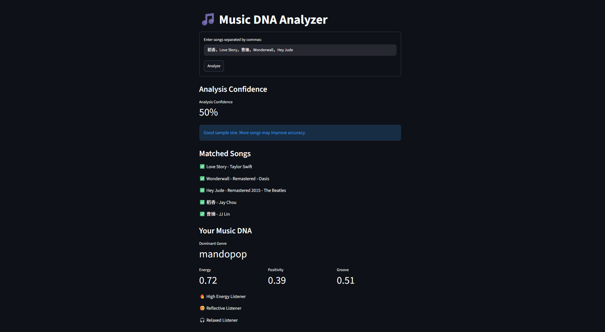
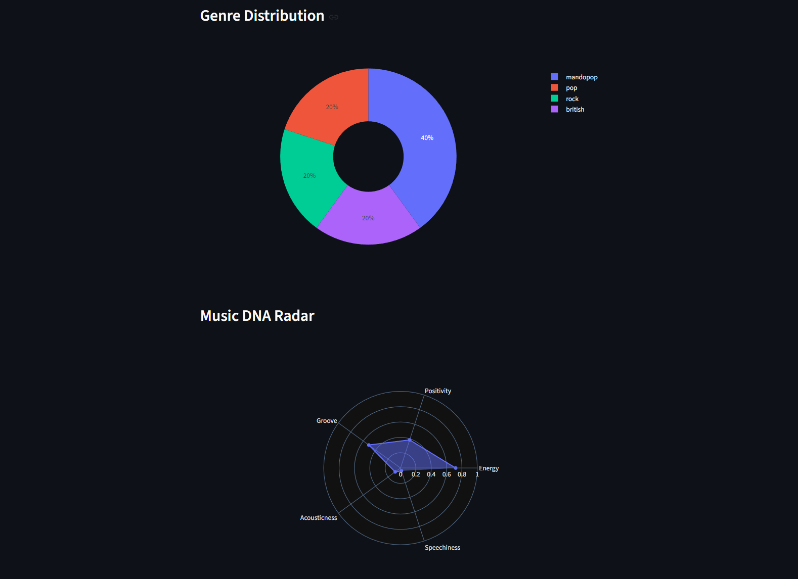
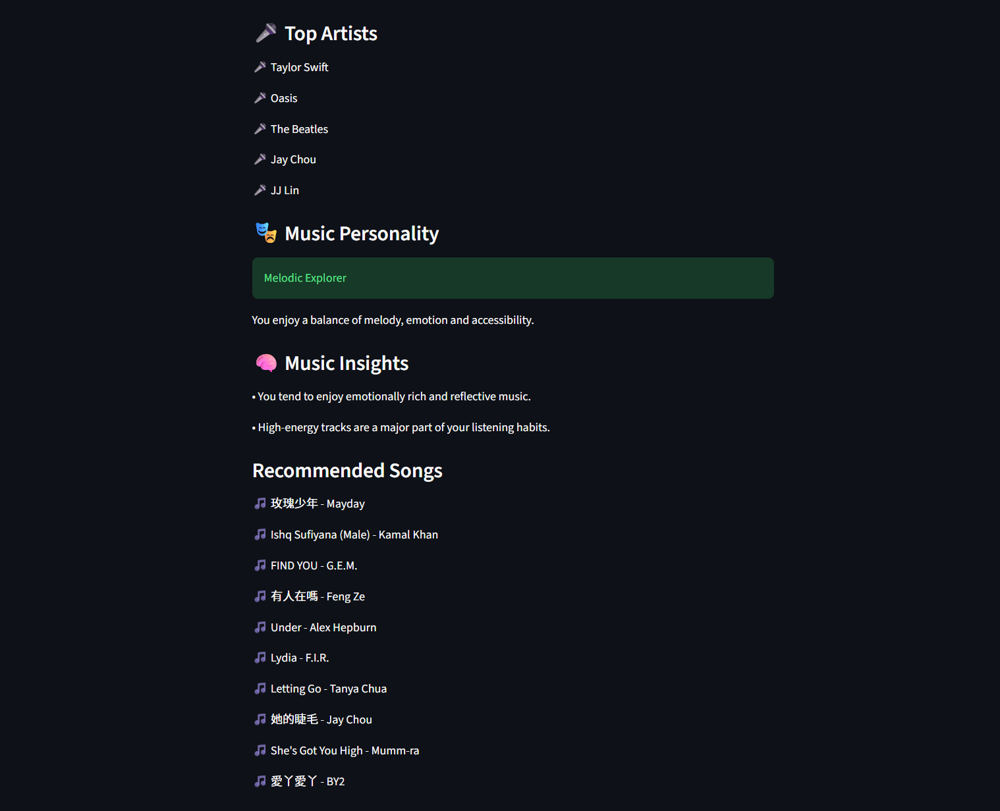

  

# 🎵 Music DNA Analyzer

A personal music analysis and recommendation web application that transforms song selections into a personalized Music DNA profile.

[🎧 Live Demo](https://music-dna-analyzer.streamlit.app/)

## Overview

Music DNA Analyzer is an interactive web application designed to help users understand their musical preferences through data analysis and visualization.

Users can enter a selection of songs and analyze their music preferences through a personalized Music DNA profile. The application then provides interactive visualizations and personalized recommendations based on the analyzed listening characteristics.

## Key Features

### 🎧 Music DNA Analysis

- Analyze a selection of songs
- Generate a personalized Music DNA profile
- Identify patterns in musical preferences
- Summarize the user's listening characteristics

### 📊 Interactive Visualization

- Visualize music preference patterns
- Explore audio feature characteristics
- Analyze music-related trends and distributions
- Present listening insights through interactive charts

### 🎵 Personalized Recommendations

- Generate recommendations based on the analyzed music profile
- Connect music preference analysis with music discovery
- Provide personalized song recommendations

## Screenshots

### Music DNA Profile

### Music Visualization

### Personalized Recommendations

## Tech Stack

- Python
- Streamlit
- Pandas
- Plotly
- Spotify API
- Data Analysis
- Recommendation System

## Workflow

User-selected Songs
↓
Music Data Collection
↓
Audio Feature Analysis
↓
Music DNA Profile
↓
Interactive Visualization
↓
Personalized Recommendations

## Project Structure

- `app.py` — Main Streamlit application
- `data/` — Music data and application data
- `utils/` — Data processing and helper functions
- `requirements.txt` — Python dependencies
- `Screenshots/` — Project screenshots

## Local Setup

### 1. Clone the repository

git clone https://github.com/LilLexW/music-dna-analyzer

cd Music-DNA

### 2. Install dependencies

pip install -r requirements.txt

### 3. Configure API credentials

Create the required environment variables for the music data APIs used by the application.

### 4. Run the application

streamlit run app.py

## Security

API credentials are stored using environment variables and are not included in the repository.

## Future Improvements

- More advanced music personality analysis
- Improved recommendation quality
- Expanded music data sources
- More interactive music exploration
- Persistent user music profiles
